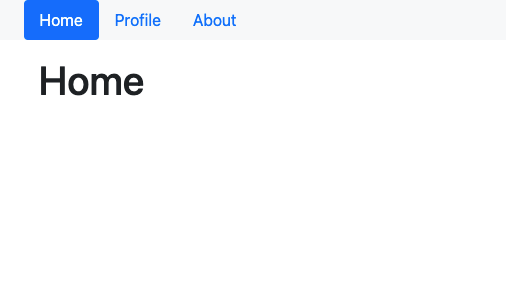
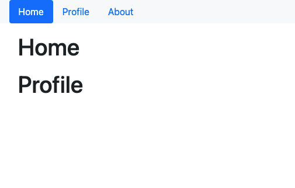

`#react-router-intro` `#assembler-school` `#master-in-software-engineering`

# Assembler School: React Router Intro Workshop <!-- omit in toc -->

In this workshop you will learn how to use routing in a React.js App.

## Table of Contents <!-- omit in toc -->

- [Getting Started](#getting-started)
- [Workshop Material](#workshop-material)
- [Dependencies](#dependencies)
- [Contents and Branches Naming Strategy](#contents-and-branches-naming-strategy)
- [React Router](#react-router)
- [Quick Start](#quick-start)
- [BrowserRouter](#browserrouter)
- [Demo App](#demo-app)
- [Authentication in Frontend Apps](#authentication-in-frontend-apps)
- [Learn More About Create React App](#learn-more-about-create-react-app)

## Getting Started

### The repo

First, you will need to clone the repo:

```bash
$ git clone https://github.com/assembler-school/react-router-intro-workshop.git
```

## Workshop Material

- [Slides](https://docs.google.com/presentation/d/17Mp4fGco3tzzu53pSFNgEgACEVIbCz88V-RyU3m6icA/edit)

## Dependencies

Before we can get started you will need to make sure that all the necessary dependencies are installed in your system.

### Create React App

This project was bootstrapped with [Create React App](https://github.com/facebook/create-react-app).

### Available Scripts

In the project directory, you can run:

#### `npm run start`

Runs the app in the development mode.\
Open [http://localhost:3000](http://localhost:3000) to view it in the browser.

The page will reload if you make edits.\
You will also see any lint errors in the console.

#### `npm run test`

Launches the test runner in the interactive watch mode.\
See the section about [running tests](https://facebook.github.io/create-react-app/docs/running-tests) for more information.

## Contents and Branches Naming Strategy

The repository is made up of several branches that include the contents and exercises of each section.

The branches follow a naming strategy like the following:

- `{NN}-exercise`: includes the main contents and the instructions of the exercises
- `{NN}-exercise-solution`: includes the solution of the exercises

### Fetching All the Branches

In order to fetch all the remote branches in the repository you can use the following command:

```bash
$ git fetch --all

# List both remote-tracking branches and local branches
$ git branch --all
```

Then, you can create a local branch based on a remote branch with the following command:

```bash
$ git checkout -b <new_branch_name> <remote_branch_name>
```

## React Router

### What is React Router?

React Router is the standard routing library for React.

From the [docs](https://reactrouter.com/web/guides/quick-start): “React Router keeps your UI in sync with the URL. It has a simple API with powerful features like lazy code loading, dynamic route matching, and location transition handling built right in.

### Why use React Router?

React Router allows us to build a single-page web application with navigation without the page refreshing as the user navigates.

React Router uses component structure to call components, which display the appropriate information.


## Quick Start

To get started with React Router in a web app, you’ll need a React web app. If you need to create one, we recommend you try `Create React App`. It’s a popular tool that works really well with React Router.

First, install `create-react-app` and make a new project with it.

In our case we don't need to create an app first because this project was bootstrapped with it.

```bash
npx create-react-app demo-app

cd demo-app
```

You can install React Router from the npm using the react-router-dom package.

```bash
npm install react-router-dom
```

## BrowserRouter

### Primary Components

There are three primary categories of components in React Router:

- routers, like `<BrowserRouter>`
- route matchers, like `<Route>` and `<Switch>`
- and navigation, like `<Link>`, `<NavLink>`, and `<Redirect>`

We also like to think of the navigation components as `route changers`. All of the components that you use in a web application should be imported from `react-router-dom`.

```jsx
import { BrowserRouter, Route, Link } from "react-router-dom";
```

### BrowserRouter Usage

A `<BrowserRouter>` uses regular URL paths. These are generally the best-looking URLs.

```jsx
// index.js
import React from "react";
import ReactDOM from "react-dom";
import { BrowserRouter } from "react-router-dom";

import App from "./App";

ReactDOM.render(
  <React.StrictMode>
    <BrowserRouter>
      <App />
    </BrowserRouter>
  </React.StrictMode>,
  document.getElementById("root")
);
```

```jsx
// App.js
import React from "react";

function App() {
  return <h1>Hello React Router</h1>;
}

export default App;
```

However, this doesn't do much so far. Let's see how to fix that.

First, let's create the following components:

```jsx
// src/pages/Home.js
import React from "react";

function Home() {
  return (
    <main className="container mt-3">
      <div className="row-cols-1">
        <div className="col">
          <h1>Home</h1>
        </div>
      </div>
    </main>
  );
}

export default Home;
```

```jsx
// src/pages/About.js
import React from "react";

function About() {
  return (
    <main className="container mt-3">
      <div className="row-cols-1">
        <div className="col">
          <h1>About</h1>
        </div>
      </div>
    </main>
  );
}

export default About;
```

```jsx
// src/pages/Profile.js
import React from "react";

function Profile() {
  return (
    <main className="container mt-3">
      <div className="row-cols-1">
        <div className="col">
          <h1>Profile</h1>
        </div>
      </div>
    </main>
  );
}

export default Profile;
```

Then, we can import them in the `App` component.

```jsx
import React from "react";

import Home from "./pages/Home";
import About from "./pages/About";
import Profile from "./pages/Profile";

function App() {
  return <h1>Hello React Router</h1>;
}

export default App;
```

### Route Matchers

There are two route matching components: Switch and Route.

When a `<Switch>` is rendered, it searches through its children `<Route>` elements to find one whose path matches the current URL. When it finds one, it renders that `<Route>` and ignores all others. This means that you should put `<Route>`s with more specific (typically longer) paths before less-specific ones.

If no `<Route>` matches, the` <Switch>` renders nothing (`null`).

#### Route

We can see try to render our page components based on the route we are at.

First, let's import and use the following `<Header />` component in our `<App />`.

```jsx
// src/components/Header.js
import React from "react";

function Header() {
  return (
    <header className="bg-light">
      <nav className="container navbar-expand">
        <div className="nav nav-pills">
          <a className="nav-item nav-link active" href="/">
            Home
          </a>
          <a className="nav-item nav-link" href="/profile">
            Profile
          </a>
          <a className="nav-item nav-link" href="/about">
            About
          </a>
        </div>
      </nav>
    </header>
  );
}

export default Header;
```

Now, we can import the `Route` component from `react-router-dom` and use it to render a page component based on the path we are in.

```jsx
// src/App.js
import React from "react";
import { Route } from "react-router";

import Home from "./pages/Home";
import About from "./pages/About";
import Profile from "./pages/Profile";

import Header from "./components/Header";

function App() {
  return (
    <div>
      <Header />
      <Route path="/" component={Home} />
      <Route path="/profile" component={Profile} />
      <Route path="/about" component={About} />
    </div>
  );
}

export default App;
```

If we click on the Home link we can see that we are navigated to the `/` path and we are rendering the `Home` component.



However, if we click on the `Profile` or `About` links we can see that both the Home and Profile or About components are rendered.



This happens because the `Route` component matches the begging of each path and the components for the `/` path will render and also the ones for `/profile` or `/about` because they start with a `/` just like the first path.

Since React Router renders and matches inclusively all Route paths unless we tell it otherwise, we need to use the `Switch` component.

```jsx
// src/App.js
import React from "react";
import { Route } from "react-router";

import Home from "./pages/Home";
import About from "./pages/About";
import Profile from "./pages/Profile";

import Header from "./components/Header";

function App() {
  return (
    <div>
      <Header />
      <Route path="/" component={Home} />
      <Route path="/profile" component={Profile} />
      <Route path="/about" component={About} />
    </div>
  );
}

export default App;
```

Furthermore, we need to replace the `a` link elements with the `NavLink` element from the `react-router-dom` library in the Header component.

```jsx
// src/components/Header.js
import React from "react";
import { NavLink } from "react-router-dom";

function Header() {
  return (
    <header className="bg-light">
      <nav className="container navbar-expand">
        <div className="nav nav-pills">
          <NavLink
            className="nav-item nav-link"
            to="/"
            activeClassName="active"
          >
            Home
          </NavLink>
          <NavLink
            className="nav-item nav-link"
            to="/profile"
            activeClassName="active"
          >
            Profile
          </NavLink>
          <NavLink
            className="nav-item nav-link"
            to="/about"
            activeClassName="active"
          >
            About
          </NavLink>
        </div>
      </nav>
    </header>
  );
}

export default Header;
```

#### Switch

It renders the first child `<Route>` or `<Redirect>` that matches the location.

How is this different than just using a bunch of `<Route>`s?

`<Switch>` is unique in that it renders a route exclusively. In contrast, every `<Route>` that matches the location renders inclusively.

Therefore, to fix our app, we need to add in the component and reorder our paths.

```jsx
// src/App.js
import React from "react";
import { Route, Switch } from "react-router";

import Home from "./pages/Home";
import About from "./pages/About";
import Profile from "./pages/Profile";

import Header from "./components/Header";

function App() {
  return (
    <div>
      <Header />
      <Switch>
        {/* If the current URL is /about or /profile, 
            these routes are rendered while the rest are ignored */}
        <Route path="/profile" component={Profile} />
        <Route path="/about" component={About} />
        {/* If none of the previous routes render anything,
            this route acts as a fallback.

            Important: A route with path="/" will *always* match
            the URL because all URLs begin with a /. So that's
            why we put this one last of all */}
        <Route path="/" component={Home} />
      </Switch>
    </div>
  );
}

export default App;
```

One important thing to note is that a `<Route path>` matches the beginning of the URL, not the whole thing. So a `<Route path="/">` will always match the URL. Because of this, we typically put this `<Route>` last in our `<Switch>`. Another possible solution is to use `<Route exact path="/">` which does match the entire URL.

We also need to use the `exact` prop on the `NavLink` component in our `Header` component.

```diff
import React from "react";
import { NavLink } from "react-router-dom";

function Header() {
  return (
    <header className="bg-light">
      <nav className="container navbar-expand">
        <div className="nav nav-pills">
          <NavLink
            className="nav-item nav-link"
            to="/"
+           exact
            activeClassName="active"
          >
            Home
          </NavLink>
          <NavLink
            className="nav-item nav-link"
            to="/profile"
            activeClassName="active"
          >
            Profile
          </NavLink>
          <NavLink
            className="nav-item nav-link"
            to="/about"
            activeClassName="active"
          >
            About
          </NavLink>
        </div>
      </nav>
    </header>
  );
}

export default Header;
```

If we want to render a 404 page we can do so in the following way:

```jsx
// src/pages/NotFound
import React from "react";

function NotFound() {
  return (
    <main className="container mt-3">
      <div className="row-cols-1">
        <div className="col">
          <h1>404</h1>
        </div>
      </div>
    </main>
  );
}

export default NotFound;
```

```diff
import React from "react";
import { Route, Switch } from "react-router";

import Home from "./pages/Home";
import About from "./pages/About";
import Profile from "./pages/Profile";
+import NotFound from "./pages/NotFound";

import Header from "./components/Header";

function App() {
  return (
    <div>
      <Header />
      <Switch>
        {/* If the current URL is /about or /profile,
            this route is rendered while the rest are ignored */}
        <Route path="/profile" component={Profile} />
        <Route path="/about" component={About} />
        {/* If none of the previous routes render anything,
            this route acts as a fallback.

            Important: A route with path="/" will *always* match
            the URL because all URLs begin with a /. So that's
            why we put this one last of all */}
+       <Route exact path="/" component={Home} />
+       <Route path="*" component={NotFound} />
      </Switch>
    </div>
  );
}

export default App;
```

#### Exact

When true, will only match if the path matches the `location.pathname` exactly.

#### Link

The `Link` component will need to be used in our app whenever we need to navigate to a page. The `NavLink` component is only used in navbars since it allows us to pass a class to mark the current page and link as active with the `activeClassName` prop.

```diff
import React from "react";
+import { Link } from "react-router-dom";

function NotFound() {
  return (
    <main className="container mt-3">
      <div className="row-cols-1">
        <div className="col">
          <h1>404</h1>
        </div>
+       <div className="col">
+         <p>
+           Go <Link to="/">home</Link>
+         </p>
+       </div>
      </div>
    </main>
  );
}

export default NotFound;
```

## Demo App

Now that we know how to use React Router, let's build a simple app using the JSONPlaceHolder API.

In this app we will build the following pages:

- `/users/:userId/todos`
- `/users/:userId`

First, we will implement the logic to fetch all the users from the api in the `Home` component.

```jsx
// src/pages/Home
import React, { useState, useEffect } from "react";
import axios from "axios";
import { Link } from "react-router-dom";

import Main from "../components/Main";

function Home() {
  const [loading, setLoading] = useState(false);
  const [error, setError] = useState(null);
  const [users, setUsers] = useState([]);

  useEffect(() => {
    async function getUsers() {
      try {
        setLoading(true);

        const response = await axios.get(
          "https://jsonplaceholder.typicode.com/users"
        );

        setError(null);
        setLoading(false);
        setUsers(response.data);
      } catch (error) {
        setError(error.message);
        setLoading(false);
      }
    }

    if (users.length === 0) {
      getUsers();
    }
  }, [users]);

  return (
    <div>
      <Main>
        {loading && (
          <section className="row-cols-1 mt-3">
            <div className="col">
              <p>Loading users...</p>
            </div>
          </section>
        )}
        {error && !loading && (
          <section className="row-cols-1 mt-3">
            <div className="col">
              <p className="mb-3">Something went wrong...</p>
              <code>{error}</code>
            </div>
          </section>
        )}
        {users.length > 0 && (
          <section className="row mt-3">
            {users.map((user) => (
              <div key={user.id} className="col col-4">
                <div className="border p-2 mb-4">
                  <code className="d-block mb-1">@{user.username}</code>
                  <Link to={`/users/${user.id}`}>User details</Link>
                </div>
              </div>
            ))}
          </section>
        )}
      </Main>
    </div>
  );
}

export default Home;
```

Then, we will create the `UserDetails` component that fetches the info of the `:userId` we provide as a route param.

```jsx
// src/pages/UserDetails
import React, { useState, useEffect } from "react";
import axios from "axios";
import { Link } from "react-router-dom";

import Main from "../components/Main";

function UserDetails({ match, history, location }) {
  const [loading, setLoading] = useState(false);
  const [error, setError] = useState(null);
  const [userData, setUserData] = useState(null);

  useEffect(() => {
    async function getUsers() {
      try {
        setLoading(true);

        const { userId } = match.params;

        const response = await axios.get(
          `https://jsonplaceholder.typicode.com/users/${userId}`
        );

        setError(null);
        setLoading(false);
        setUserData(response.data);
      } catch (error) {
        setError(error.message);
        setLoading(false);
      }
    }

    if (!userData) {
      getUsers();
    }
  }, [userData, match.params]);

  return (
    <div>
      <Main>
        {loading && (
          <section className="row-cols-1 mt-3">
            <div className="col">
              <p>Loading user data...</p>
            </div>
          </section>
        )}
        {error && !loading && (
          <section className="row-cols-1 mt-3">
            <div className="col">
              <p className="mb-3">Something went wrong...</p>
              <code>{error}</code>
            </div>
          </section>
        )}
        {userData && (
          <section className="row-cols-1 mt-3">
            <div className="col">
              <h1 className="h4">User: {userData.name}</h1>
              <hr />
            </div>
            <div className="col">
              <Link to={`${match.url}/todos`}>User todos</Link>
              <hr />
            </div>
            <div className="col">
              <pre>
                <code className="d-block mb-1">
                  {JSON.stringify(userData, null, 2)}
                </code>
              </pre>
            </div>
          </section>
        )}
      </Main>
    </div>
  );
}

export default UserDetails;
```

Then, we need to create the route:

```diff
// src/App
import React from "react";
import { Route, Switch } from "react-router";

import Home from "./pages/Home";
import About from "./pages/About";
import Profile from "./pages/Profile";
import NotFound from "./pages/NotFound";
import Header from "./components/Header";
+import UserDetails from "./pages/UserDetails";

function App() {
  return (
    <div>
      <Header />
      <Switch>
        {/* If the current URL is /about or /profile,
            this route is rendered while the rest are ignored */}
        <Route path="/profile" component={Profile} />
        <Route path="/about" component={About} />
        {/* If none of the previous routes render anything,
            this route acts as a fallback.

            Important: A route with path="/" will *always* match
            the URL because all URLs begin with a /. So that's
            why we put this one last of all */}
+       <Route path="/users/:userId" component={UserDetails} />
        <Route exact path="/" component={Home} />
        <Route path="*" component={NotFound} />
      </Switch>
    </div>
  );
}

export default App;
```

Now that we have the page ready to fetch the user details, we can create another page for the user todos.

```jsx
// src/pages/UserTodos
import React, { useState, useEffect } from "react";
import axios from "axios";
import { useRouteMatch } from "react-router-dom";

import Main from "../components/Main";

function UserTodos() {
  const [loading, setLoading] = useState(false);
  const [error, setError] = useState(null);
  const [todos, setTodos] = useState([]);

  const { url } = useRouteMatch();

  useEffect(() => {
    async function getUsers() {
      try {
        setLoading(true);

        const response = await axios.get(
          `https://jsonplaceholder.typicode.com${url}`
        );

        setError(null);
        setLoading(false);
        setTodos(response.data);
      } catch (error) {
        setError(error.message);
        setLoading(false);
      }
    }

    if (todos.length === 0) {
      getUsers();
    }
  }, [todos, url]);

  return (
    <div>
      <Main>
        {loading && (
          <section className="row-cols-1 mt-3">
            <div className="col">
              <p>Loading user data...</p>
            </div>
          </section>
        )}
        {error && !loading && (
          <section className="row-cols-1 mt-3">
            <div className="col">
              <p className="mb-3">Something went wrong...</p>
              <code>{error}</code>
            </div>
          </section>
        )}
        {todos.length > 0 && (
          <section className="row-cols-1 mt-3">
            {todos.map((todo) => (
              <div className="col" key={todo.id}>
                <pre>
                  <code className="d-block mb-1">
                    {JSON.stringify(todo, null, 2)}
                  </code>
                </pre>
              </div>
            ))}
          </section>
        )}
      </Main>
    </div>
  );
}

export default UserTodos;
```

And the route handler:

```diff
// src/App
import React from "react";
import { Route, Switch } from "react-router";

import Home from "./pages/Home";
import About from "./pages/About";
import Profile from "./pages/Profile";
import NotFound from "./pages/NotFound";
import Header from "./components/Header";
import UserDetails from "./pages/UserDetails";
+import UserTodos from "./pages/UserTodos";

function App() {
  return (
    <div>
      <Header />
      <Switch>
        {/* If the current URL is /about or /profile,
            this route is rendered while the rest are ignored */}
        <Route path="/profile" component={Profile} />
        <Route path="/about" component={About} />
        {/* If none of the previous routes render anything,
            this route acts as a fallback.

            Important: A route with path="/" will *always* match
            the URL because all URLs begin with a /. So that's
            why we put this one last of all */}
+       <Route path="/users/:userId/todos" component={UserTodos} />
        <Route path="/users/:userId" component={UserDetails} />
        <Route exact path="/" component={Home} />
        <Route path="*" component={NotFound} />
      </Switch>
    </div>
  );
}

export default App;
```

## Authentication in Frontend Apps

So far, anyone can access our app. But let's say that we only want logged in users to see the todos of each person.

For this, lets create a `ProtectedRoute` component.

```jsx
// src/components/ProtectedRoute
import React from "react";
import { Route, Redirect } from "react-router-dom";

function ProtectedRoute({ isAuthenticated, ...props }) {
  return isAuthenticated ? <Route {...props} /> : <Redirect to="/" />;
}

export default ProtectedRoute;
```

The way we would use this component is using the following logic in our App component:

```diff
-<Route path="/users/:userId/todos" component={UserTodos} />
+<ProtectedRoute
+  isAuthenticated={isAuthenticated}
+  path="/users/:userId/todos"
+  component={UserTodos}
+/>
```

The rest of the component:

```jsx
// src/App
import React, { useEffect, useState } from "react";
import { Route, Switch } from "react-router";

import Home from "./pages/Home";
import About from "./pages/About";
import Profile from "./pages/Profile";
import NotFound from "./pages/NotFound";
import UserDetails from "./pages/UserDetails";
import UserTodos from "./pages/UserTodos";

import Header from "./components/Header";
import ProtectedRoute from "./components/ProtectedRoute";

function useLocalStorage(deps) {
  useEffect(() => {
    localStorage.setItem("authState", JSON.stringify(deps));
  }, [deps]);
}

function loadAuthState() {
  const authState = localStorage.getItem("authState");

  if (authState === null) {
    return {
      isAuthenticated: false,
    };
  }

  return JSON.parse(authState);
}

function App() {
  const [authState, setAuthState] = useState(() => loadAuthState());

  const { isAuthenticated } = authState;

  useLocalStorage(authState);

  function login() {
    setAuthState({
      isAuthenticated: true,
    });
  }

  function logout() {
    setAuthState({
      isAuthenticated: false,
    });
  }

  return (
    <div>
      <Header isAuthenticated={isAuthenticated} login={login} logout={logout} />
      <Switch>
        {/* If the current URL is /about or /profile, 
            this route is rendered while the rest are ignored */}
        <Route path="/profile" component={Profile} />
        <Route path="/about" component={About} />
        {/* If none of the previous routes render anything,
            this route acts as a fallback.

            Important: A route with path="/" will *always* match
            the URL because all URLs begin with a /. So that's
            why we put this one last of all */}
        <ProtectedRoute
          isAuthenticated={isAuthenticated}
          path="/users/:userId/todos"
          component={UserTodos}
        />
        <Route path="/users/:userId/todos" component={UserTodos} />
        <Route path="/users/:userId" component={UserDetails} />
        <Route exact path="/" component={Home} />
        <Route path="*" component={NotFound} />
      </Switch>
    </div>
  );
}

export default App;
```

And the updated `Header` component:

```jsx
// src/components/Header
import React from "react";
import { NavLink } from "react-router-dom";

function Header({ isAuthenticated, login, logout }) {
  return (
    <header className="bg-light p-3">
      <nav className="container navbar-expand">
        <div className="d-flex">
          <div className="nav nav-pills">
            <NavLink
              className="nav-item nav-link"
              to="/"
              exact
              activeClassName="active"
            >
              Home
            </NavLink>
            <NavLink
              className="nav-item nav-link"
              to="/profile"
              activeClassName="active"
            >
              Profile
            </NavLink>
            <NavLink
              className="nav-item nav-link"
              to="/about"
              activeClassName="active"
            >
              About
            </NavLink>
          </div>
          <div className="d-flex ml-auto">
            {isAuthenticated ? (
              <div className="d-flex align-items-center">
                <p className="mb-0 mr-3">Hello!</p>
                <button className="btn btn-primary" onClick={logout}>
                  Logout
                </button>
              </div>
            ) : (
              <button className="btn btn-primary" onClick={login}>
                Login
              </button>
            )}
          </div>
        </div>
      </nav>
    </header>
  );
}

export default Header;
```

## Learn More About Create React App

You can learn more in the [Create React App documentation](https://facebook.github.io/create-react-app/docs/getting-started).

To learn React, check out the [React documentation](https://reactjs.org/).

## Author <!-- omit in toc -->

[Dani Lucaci](https://github.com/danilucaci)

## License <!-- omit in toc -->

[MIT](https://choosealicense.com/licenses/mit/)
